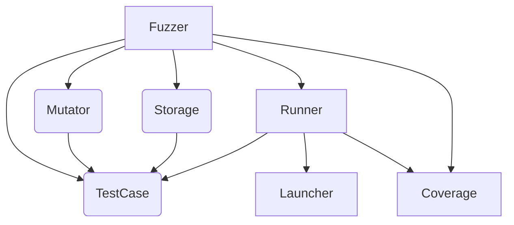

1. Видится так, что связи между модулями должны делаться публичными, в том случае, если предполагается, что один модуль взаимодействует с другим модулем, и необходимость этого взаимодействия каким-то образом описана в интерфейсе модуля (модулей). Примером может послужить модуль Parser, который выполняет разбор тех или иных данных и модулем, предоставляющим абстрактный интерфейс Stream, который предоставляет функции чтения данных из того или иного источника. В этом случае, например, интерфейс модуля Parser предполагает, исполользованием модуля Stream и эта связь публична. 

2. Исходя предыдущего пункта, как самый простой вариант на ум приходит метрика, считающая относительное количество публичных связей между модулями, к примеру - средняя степень вершин графа  зависимостей модулей. Как альтернативу можно взять метрику, которая считает не только количество связей, но и сложность графа модулей проекта в целом. 

3. Рассмотрим  в качестве примера следующую систему классов (модулей): 

	
 Для неё можно вывести такой показатель: число вершин = 7, число степень сумма степеней вершин = 19, таким образом итоговая метрика = 2.71 . Верхней границей "приемлемой модульности" можно принять показатель в 3.5 - 4, например.  
