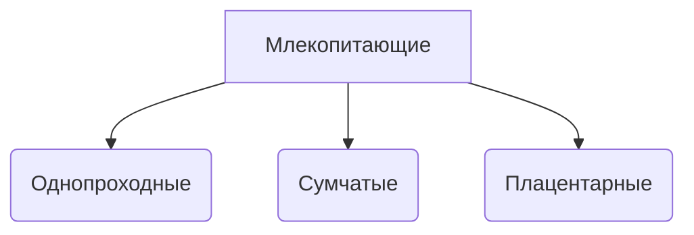

## Пример наследования подтипов
Примером такого наследования может явиться иерарахия классов 

## Пример наследования с ограничением
Пример такого наследования - это наследование класса "Окружность" от класса "Эллипс".

## Пример наследования с расширением
Примером такого наследования может явиться наследование класса "Комплексное число" от класса "Действительное число"
